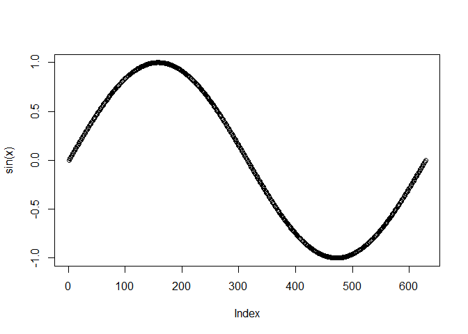

## 向量

```r
a <- c(3, 5, 10, 5, 6)
a[1]
```

```
## [1] 3
```

## 画图

```r
x <- seq(0,2*pi,0.01)
plot(sin(x))
```

<!-- -->

## 安装包

```r
if (!require("BeSS")) install.packages("BeSS")
```

```
## 载入需要的程辑包：BeSS
```

```
## Warning: 程辑包'BeSS'是用R版本4.3.3 来建造的
```

```r
library(BeSS)

data <- gen.data(n=500, p=20, family = "gaussian", K=10)
fit  <- bess(data$x, data$y)
```

```
## 1-th iteration s.left:1 s.split:13 s.right:20
## 2-th iteration s.left:1 s.split:8 s.right:13
## 3-th iteration s.left:8 s.split:11 s.right:13
## 4-th iteration s.left:8 s.split:10 s.right:11
## 5-th iteration s.left:8 s.split:9 s.right:10
```

```r
print(fit)
```

```
##      Df          MSE        AIC         BIC       EBIC
## [1,]  1 1.256839e+04 4721.47026 4725.684869 4731.67633
## [2,] 20 8.824982e-01  -22.49926   61.792900  181.62219
## [3,] 13 8.869250e-01  -33.99740   20.792504   98.68154
## [4,]  8 9.192682e+02 3427.78898 3461.505844 3509.43756
## [5,] 11 8.916072e-01  -35.36482   10.995865   76.90198
## [6,] 10 8.972751e-01  -34.19636    7.949717   67.86436
## [7,]  9 2.426926e+00  461.31281  499.244278  553.16746
```
