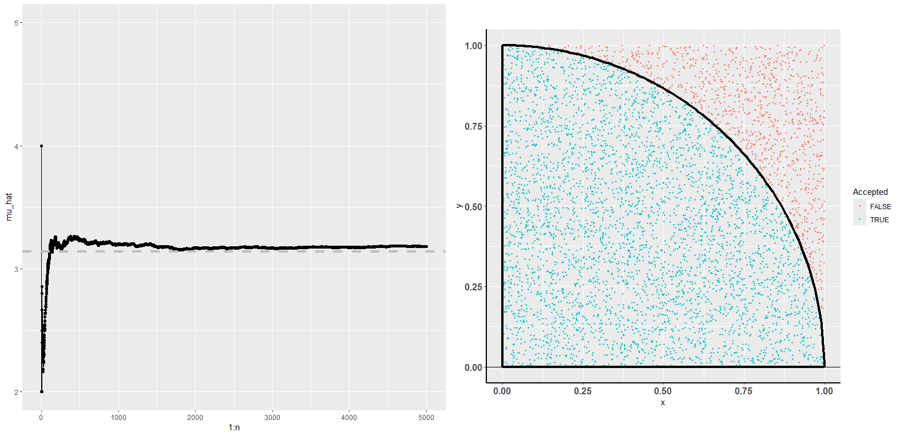
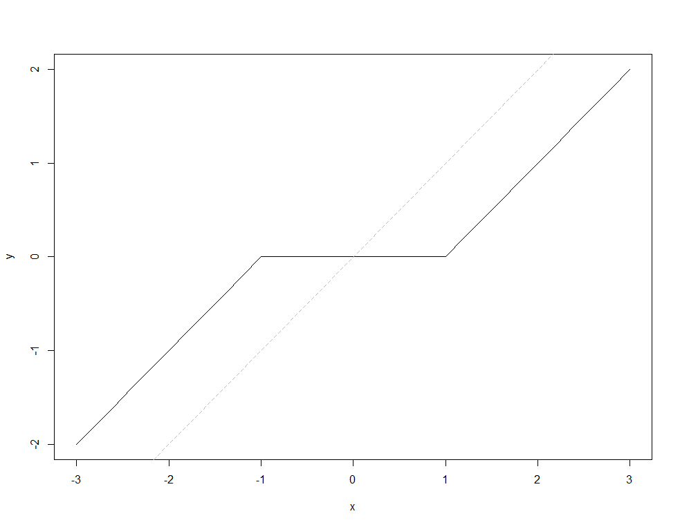

```{r setup, include=FALSE}
knitr::opts_chunk$set(echo = TRUE)
```

## ggplot2

1. 通过计算，有以下二重积分

$$
\int_{0}^1 \int_{0}^1 I(x^2 + y^2<1)dx dy = \frac{\pi}{4}.
$$
请根据上式构造合适的随机变量，通过蒙特卡洛方法估计圆周率，并基于ggplot2绘制以下图形。


其中随机种子为123，n=5000, 右图是基于样本量为5000的样本绘制的。

```{r}
library(ggplot2)

# 设置随机种子以确保结果的可重复性
set.seed(123)

# 生成随机点的数量
n_points <- 10000

# 生成随机点的横坐标和纵坐标，均匀分布在[0,1]区间内
x <- runif(n_points)
y <- runif(n_points)

# 判断每个点是否在单位圆内
in_circle <- x^2 + y^2 < 1

# 计算落入单位圆内的点的数量
points_in_circle <- sum(in_circle)

# 使用蒙特卡洛方法估计圆周率
estimated_pi <- 4 * points_in_circle / n_points

# 打印估计的圆周率
cat("估计的圆周率:", estimated_pi, "\n")

# 创建数据框
df <- data.frame(x, y, in_circle)

# 绘制散点图
p <- ggplot(df, aes(x, y, color = in_circle)) +
  geom_point() +
  scale_color_manual(values = c("blue", "red")) +
  theme_minimal() +
  ggtitle("Monte Carlo Estimation of Pi") +
  labs(x = "x", y = "y") +
  theme(legend.title = element_blank(),
        plot.title = element_text(hjust = 0.5))

# 显示图形
print(p)

```

## 函数

1. 请根据以下定义编写函数myfun，

$$
f(x) = \left\{ \begin{array}{cl} x-\lambda & \mathrm{if}~x > \lambda\\
0 &\mathrm{if}~ |x| \leq \lambda\\
x + \lambda &\mathrm{if}~ x< -\lambda\end{array}\right.
$$
其中输入为数值型向量或者标量`x`，正数 $\lambda$ 。绘制如下 $\lambda=1$ 时函数图像：


```{r}
myfun <- function(x, lambda) {
  ifelse(x > lambda, x - lambda, ifelse(abs(x) <= lambda, 0, x + lambda))
}

# 绘制函数图像
lambda <- 1
x <- seq(-2, 2, by = 0.01)
y <- myfun(x, lambda)
plot(x, y, type = "l", col = "blue", xlab = "x", ylab = "f(x)", main = paste("lambda =", lambda))

```


2. 基于上述函数编写求解以下问题的算法（需要用到循环结构）

$$
\min_\beta L(\beta) = \frac{1}{2} \|y- X\beta\|^2 + \lambda \sum_{j=1}^p |\beta_j|,
$$
其中y 是一个n维的向量， X是一个 $n\times 2$ 的矩阵， $\beta$ 是一个2维的向量。算法描述如下：

    - 在给定当前解 $hat\beta$ 时，对每一个维度 $j$ ,局部最优解为 
$$
    f\left(\frac{X_j^T(y-X\hat\beta + X_j\hat\beta_j)}{\|X_j\|^2}, \lambda/\|X_j\|^2\right)
$$

    - 遍历 $j=1, 2, 1, 2,... $ 直到前后两个解的平方差小于给定的误差（如 `1e-6` ）。
    
    
最后通过模拟数据验证上述算法是否编写正确并输出最后的估计值，模拟数据代码如下：

```{r}
set.seed(123)
beta <- c(1,0)
n <- 1000
x <- matrix(rnorm(n*2), n, 2)
y <- x%*%beta + rnorm(n, 0, 0.5)
```

将求解流程编写成一个函数 `lasso_solver` ，输入至少包含 `(X, y, lambda)`，输出为 $\beta$ 最后的估计值。比较 $\lambda$ 取不同值时结果的区别。（还可以观察 $\beta$ 取不同初始值时结果的区别，不作为强制要求）
```{r}
lasso_solver <- function(X, y, lambda, epsilon = 1e-6, max_iter = 1000) {
  n <- nrow(X)
  p <- ncol(X)
  beta <- rep(0, p)  # 初始估计值，可以选择不同的初始值
  
  # 定义函数来计算 f(beta_j, lambda_j)
  f <- function(beta_j, lambda_j) {
    ifelse(beta_j > lambda_j, beta_j - lambda_j, ifelse(beta_j < -lambda_j, beta_j + lambda_j, 0))
  }
  
  iter <- 0
  while (iter < max_iter) {
    iter <- iter + 1
    beta_prev <- beta
    
    for (j in 1:p) {
      X_j <- X[, j]
      beta_j <- beta[j]
      
      # 计算局部最优解
      numerator <- t(X_j) %*% (y - X %*% beta + X_j * beta_j)
      denominator <- sum(X_j^2)
      beta[j] <- f(numerator / denominator, lambda / denominator)
    }
    
    # 判断是否收敛
    if (sum((beta - beta_prev)^2) < epsilon) {
      break
    }
  }
  
  if (iter == max_iter) {
    warning("Maximum number of iterations reached without convergence.")
  }
  
  return(beta)
}

# 模拟数据
set.seed(123)
beta_true <- c(1, 0)
n <- 1000
X <- matrix(rnorm(n*2), n, 2)
y <- X %*% beta_true + rnorm(n, 0, 0.5)

# 设置不同的 lambda 值
lambda_values <- c(0.1, 0.5, 1, 2)

# 输出结果
for (lambda in lambda_values) {
  cat("Lambda:", lambda, "\n")
  beta_est <- lasso_solver(X, y, lambda)
  cat("Estimated beta:", beta_est, "\n\n")
}

```